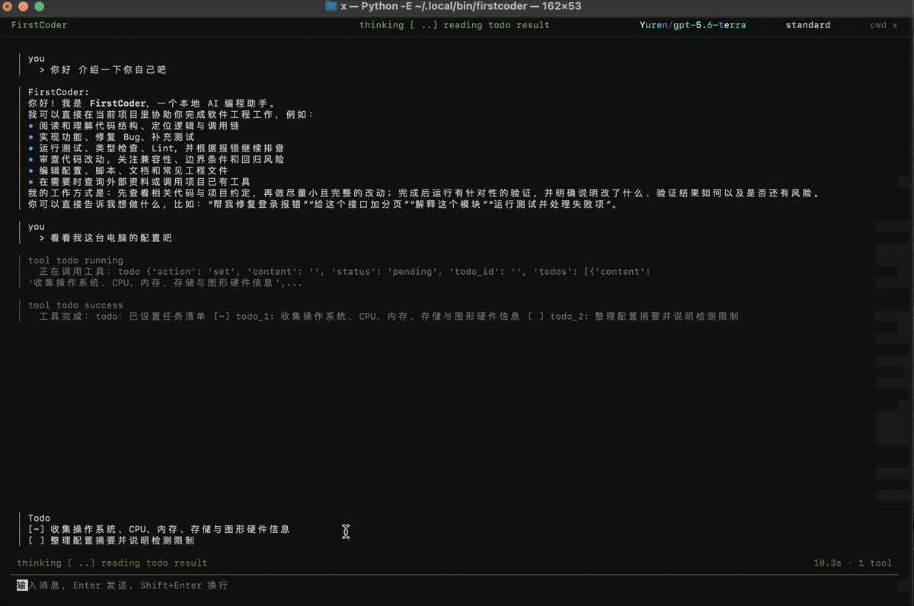
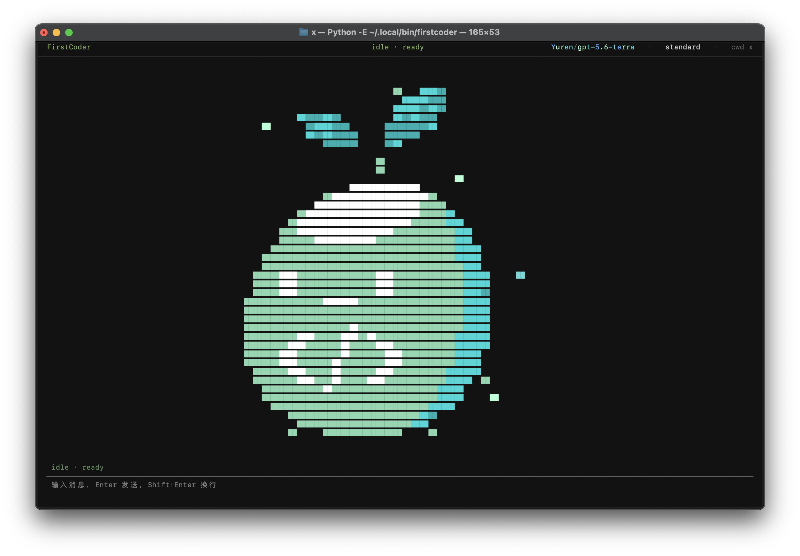

<h1 align="center">AgentLens</h1>

<p align="center">
  <strong>一个把 coding agent 内部机制摊开给你看的本地 Python 项目。</strong>
</p>

<p align="center">
  <a href="#快速开始"></a>
  <a href="#tui"></a>
  <a href="#配置"></a>
  <a href="#开发"></a>
  <a href="https://deepwiki.com/explore-ai-dev/AgentLens"></a>
</p>

<p align="center">
  <a href="README.md">English</a>
  · 简体中文
</p>

---

AgentLens 是一个能真实运行的本地 coding agent，带有 Textual TUI、工具调用、权限系统、会话持久化和上下文压缩。它既可以日常使用，也刻意保持了适合阅读和学习的 Python 代码结构。

如果你想真正理解 coding agent 是怎么工作的，AgentLens 会尽量把关键环节展示出来，而不是把它们藏在黑盒后面。

- 学习 agent loop、工具调用、权限系统、session 和上下文处理。
- 基于一个模块边界清晰的小型 Python 代码库继续改造。
- 一边使用本地 coding agent，一边读懂它的内部机制。



## 为什么做 AgentLens

大多数 coding-agent 演示展示的是表面：一个 prompt 进去，代码改完出来。AgentLens 关注的是中间的机械结构。

和 OpenCode 这类更大的项目相比，AgentLens 刻意把范围收得更小。

| 维度 | AgentLens | OpenCode 这类更大的项目 |
| --- | --- | --- |
| 主要目标 | 把 agent 内部机制做得可读、可学、可讲清楚 | 提供更完整、更偏产品化的 coding-agent 平台 |
| 代码形态 | 当前仓库核心运行时代码约 1.7 万行 Python | TS/JS 代码规模约 57 万行，平台层和工程表面也更多 |
| 工程取舍 | 主动放弃一部分额外平台能力，换取更强可读性 | 接受更高复杂度，以支持更宽的产品能力面 |
| 更适合谁 | 学习、二次改造、面试讲解、作品集 / 简历项目、本地实验 | 更想直接使用一个大而完整的 coding-agent 环境的用户 |

目标不是在功能数量上和更大的 coding agent 正面对抗，而是把系统做得既足够真实可用，又足够小，让你还能从头到尾读懂它，并理解每个子系统为什么存在。

这也意味着 AgentLens 很适合被深入学习、按自己的工作流继续改造，并在做出有代表性的扩展后，作为一个能写进简历或作品集的项目来展示。

和更偏教程型、轻量参考型的学习项目相比，AgentLens 也尽量保持它更像一个“小而完整、可验证”的工程系统。

| 维度 | AgentLens | 常见学习型 agent 项目 |
| --- | --- | --- |
| 学习价值 | 子系统边界清楚，文档明确，适合按模块阅读 | 往往更偏单一路径教程或 demo 流程 |
| 实用表面 | 有真实 TUI、tools、permissions、sessions、provider adapters | 往往更聚焦某个更窄的 loop 或概念验证 |
| 可验证性 | 有 80+ 个测试文件，并接入了多个 benchmark 入口 | 往往较少强调测试体系和 benchmark 集成 |
| 延展路径 | 更适合继续改造成作品集或简历项目 | 更适合跟做和入门，但未必适合长期扩展 |

也就是说，这个仓库在“适合学习”之外，还尽量保留了足够的运行时结构、测试和 benchmark 钩子，让它在你第一次读完之后依然有继续演化的价值。

它适合这样的人：

- 想系统理解一个 coding agent 是如何组织起来的
- 想修改或扩展一个本地 Python 实现
- 想把 agent 架构真正看懂，并能在面试或学习中讲清楚

更细的子系统说明已经放进文档，这个 README 只保留项目首页需要的信息。

## 快速开始

推荐用 `pipx` 安装：

```sh
pipx install firstcoder
```

启动 TUI：

```sh
firstcoder
```

不打开 TUI，直接跑一轮消息：

```sh
firstcoder --message "用一段话介绍这个仓库"
```

使用行式交互模式：

```sh
firstcoder --interactive
```

## 你会得到什么

- 本地 Python coding agent
- 不隐藏 agent 活动状态的 Textual TUI
- 对危险操作先做权限确认的工具调用流程
- 会话持久化、恢复和上下文压缩
- 适合学习和二次开发的 skills、provider 和清晰模块结构

## 配置

创建初始配置：

```sh
firstcoder config init
firstcoder config path
firstcoder config show
```

密钥建议放在环境变量里：

```sh
export FIRSTCODER_API_KEY="your-api-key"
```

默认配置路径：

```text
全局:  ~/.config/firstcoder/config.toml
项目:  ./firstcoder.toml
```

> 给细心用户的小提示：某些 provider 与模型组合，会让 TUI 顶栏多一点个性。

## TUI

AgentLens 的 TUI 不是为了把 agent loop 藏起来，而是为了把它展示出来。你可以在一个界面里看到 session 状态、流式输出、工具调用、工具结果和权限请求。

空闲状态：



基础对话流：


## 文档

- [技术文档入口](docs/README.zh-CN.md)
- [English Docs Index](docs/README.md)
- [代码阅读指南](docs/CODEBASE_READING_GUIDE.zh-CN.md)
- [MCP 客户端配置](docs/MCP.zh-CN.md)

## 开发

安装开发依赖：

```sh
python -m venv .venv
.venv/bin/python -m pip install -e ".[dev]"
```

运行全部测试：

```sh
.venv/bin/python -m pytest
```

运行单个测试文件：

```sh
.venv/bin/python -m pytest tests/test_app_tui.py -q
```

## 设计理念

AgentLens 想回答的是一个很多 coding agent 不会正面回答的问题：

> 当 agent 在流式输出、调用工具、申请权限、压缩上下文、恢复会话时，
> 内部到底发生了什么？

它是一个真实可运行的 agent，但它同样也是一个可以按子系统逐步读懂的 Python 项目。
